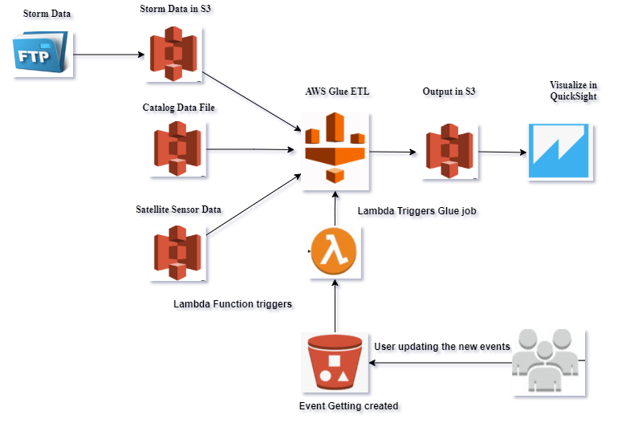

# Building Data Pipeline for SEVIR Dataset using AWS

### INTRODUCTION

The goal is to develop a data pipeline to ingest, process and visualize  Storm EVent ImagRy (SEVIR) dataset using components in the AWS ecosystem

### DATA SOURCES
#### Input Data Sources

1 - Storm data has 3 types of csv files 
     
     StormEvents_details
     StormEvents_fatalities
     StormEvents_locations

The location of the Files are :- https://www1.ncdc.noaa.gov/pub/data/swdi/stormevents/csvfiles/

2 - SEVIR contains two major components:

Catalog: A CSV file with rows describing the metadata of an event 
Data Files: A set of HDF5 files containing events for a certain sensor type
      
	  Catalog Location   : https://s3.console.aws.amazon.com/s3/buckets/sevir?prefix=data%2F&region=us-west-2
      Data Files Location: https://s3.console.aws.amazon.com/s3/object/sevir?region=us-west-2&prefix=CATALOG.csv

The satellite image data is captured by 5 sensors, each sensor have a folder in s3 bucket and images are saved as h5 files

#### Output Data 

The output of the pipeline is stored in the s3 bucket for aws, the path would be mentioned in output component of Glue pipeline

### Architecture

AWS Glue Studio is used for data ingestion, transformation, integration and writing output back to AWS S3 buckets

Amazon QuickSight is used for query data and build visuals

### Usage

#### AWS Glue Pipeline
STEP 1 - You need an AWS account

STEP 2 - Download all three types of storm files and upload them to the S3 bucket

STEP 3 - In the Glue service, go to the AWS Glue Studio and create a new job 

STEP 4 - In the job, go to the scripts and paste the script in the python folder from github

STEP 5 - Change the input location of the Files and output location of the Files

STEP 6 - You need to create a role which has permission to Glueservices and S3

STEP 7 - Run the Job and see the output in the output S3 folder

#### AWS Lambda Function

STEP 1 - Create a lamdba function using the lambda_toivoke_gluejob.py file

STEP 2 - Create a Trigger which would call the lambda function when CATALOG.CSV file is updated

STEP 3 - Create a Lamdbda role which would have access to Glue services

#### AWS QuickSight

STEP 1 - Register for the AWS QuickSight Service

STEP 2 - Create a Dataset , using the manifest file in the quicksight folder, change the Location in the manifest file according to your S3 buckets/sevir

STEP 3 - Create New Analysis and you can create dashboards there

### CLAAT Document

https://docs.google.com/document/d/10nxtIU1BLjj-YgayO_XC6u9ABWcGvwdMrDSxi9pu_z0/edit#heading=h.ro8ivw5cavxe

 
