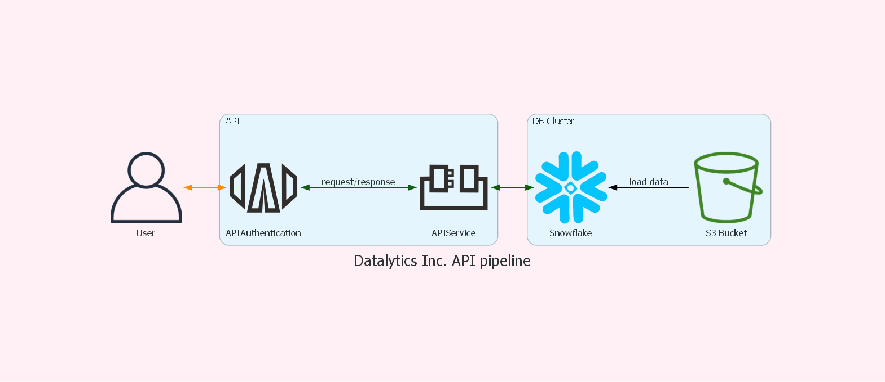

# Building Fast API application

### INTRODUCTION

- The goal is to build a Fast API application
- Review Moody’s API webinar and prepare a Graphviz diagram
- Upload Healthcare data from Kaggle to S3 Bucket and load it in Snowflake Database
- Build an API that can be used to query different aspects of the dataset.

### DATA SOURCES
#### Input Data Sources

https://www.kaggle.com/tamilsel/healthcare-providers-data

### Architecture

### Usage

#### Ingestion Pipeline

STEP 1 : Create an Snowflake Account and get the account id from it

STEP 2 : Download the Data from Kaggle and upload to S3 bucket

STEP 3 : Run the airflow sceduler and then airflow webserver --port 88

STEP 4 : Go to the API folder and start the API by using uvicorn api:app --reload

STEP 5:  Hit the API using following endpoints:
http://127.0.0.1:8000/get_from_location
http://127.0.0.1:8000/get_from_name
http://127.0.0.1:8000/get_national_provider_identifier

Pass the body and API token while calling the API

### CLAAT Document

https://docs.google.com/document/d/1-NmnM7srwGWZ-45wySZgE22JYcwdVlXZcJR4a7x-q_E/edit?usp=sharing

 
