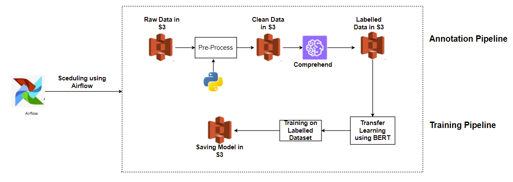
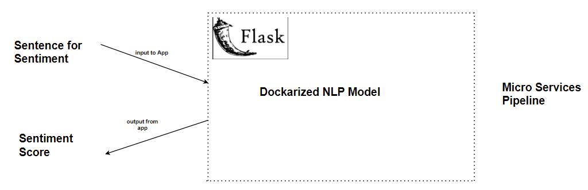

# Building Data Pipeline for Sentimental Analysis

### INTRODUCTION

The goal is to build Sentiment analysis micro service from unstructured data

Dataset used was EDGAR which had call transcripts of various companies

User can use the micro service to get the sentiment score for their individual company

### DATA SOURCES
#### Input Data Sources

EDGAR Dataset which has call transcripts of 44 companies

#### Output Data 

Output would be store in S3 Bucket, it would be a CSV File , which would have Sentence as one column and sentiment score as other

### Architecture

AWS Glue Studio is used for data ingestion, transformation, integration and writing output back to AWS S3 buckets

Amazon QuickSight is used for query data and build visuals

### Usage

#### Annotation and Training Pipeline

STEP 1 : Upload all the call transcripts to S3 bucket 

STEP 2 : Cleaned the data using Spacy library to remove Stopwords, remove whitespaces and using regex function to remove punctuation characters

STEP 3 : Stored Cleaned Data in S3 Bucket

STEP 4: Read the Cleaned Data , split every sentence on the basis of “.” character and hit the Amazon comprehend Api to get the Sentiment score

STEP 5: The sentiment score obtained from Amazon Comprehend is in 0-1 range with 0 being negative and 1 being positive. Normalize this range from -1 to 1.

STEP 6: Stored the Output to S3 bucket in CSV format, which is labelled data

STEP 7: Use BERT pre-trained model for sentiment analysis

STEP 8: Train the model on the labelled EDGAR dataset

STEP 9: Save the model and load it in S3 bucket

STEP 10 :  Scheduled the annotation and Training Pipeline using Airflow

#### Micro Services Pipeline

STEP 1: Use docker build -t ml_deploy_demo:latest . to build the image file of the dockerized models

STEP 2 : Get the newly generated id by using docker images

STEP 3: docker run -it --rm -p 5000:5000 {image_id} /bin/bash ml_deploy_demo/run.sh

STEP 4: We can then test the api by using a unit test case scenario for the hosted flask api.

STEP 5: Now after deploying the model on docker we checked if we are getting prediction using postman:

####  Inference Pipeline

STEP 1: Hit the Fast Api to get the call transcripts with year and Company code

STEP 2 : Cleaned the data using Spacy library to remove Stopwords, remove whitespaces and using regex function to remove punctuation characters

STEP 3: For every file, hit the Docarized NLP model to get the sentimental score

STEP 4:Stored the output in the CSV File for each company in S3 buckets

#### Tree structure

Assignment_2/
├── comprehend/
│   └── comprehend.py
├── dag/
│   ├── AnnotationAndTraining_Pipeline.py
│   └── Inference_Pipeline.py
├── dataprocessing/
│   └── dataprocessing.py
├── images/
│   ├── pipeline_1.PNG
│   ├── pipeline_2.PNG
│   └── pipeline_3.PNG
├── inference/
│   └── inference.py
├── Makefile
├── README.md
└── requirements.txt

### CLAAT Document

https://docs.google.com/document/d/145ucdFuMAHekxhQy00UdD-H_JNqAjbHCuHR_CSWc42E/edit#

 
