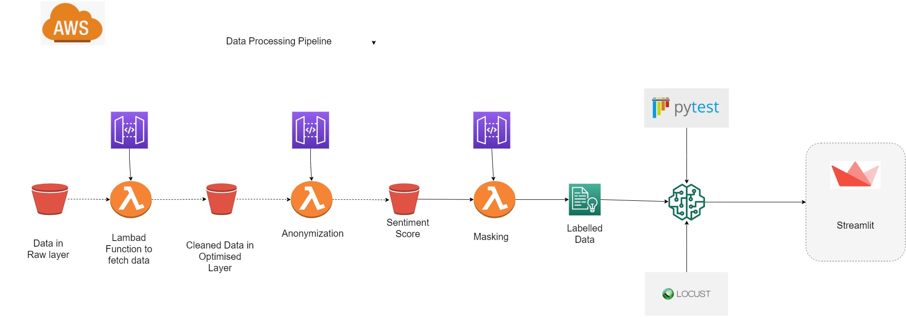

# Building Lambda Functions with API

### INTRODUCTION

INTRODUCTION
API1: Access
This API retrieves the EDGAR filings data from the S3 bucket
API2: Named entity recognition
This API takes a link to a file on S3 and:
Call Amazon Comprehend anonymize data to recognize the entities for anonymization
Store these on S3
API3: Implement masking, and anonymization functions.
This API masks the data 

Use pre-trained AlBert model trained on IMDB dataset to predict sentiment of each sentences of EDGAR dataset

### Input Data Sources

EDGAR Dataset which has call transcripts of 44 companies

### Output 

A streamlit application to display results of all the 3 APIs and display the prediction of AlBert model for sentiment prediction.

Annotation and Training Pipeline
Architecture

### Architecture

### Process:
STEP 1 : Read EDGAR dataset from S3 using lambda function

STEP 2 : Cleaned the data using Spacy library to remove Stopwords, remove whitespaces and using regex function to remove punctuation characters

STEP 3 : Stored Cleaned Data in S3 Bucket

STEP 4: Read the Cleaned Data , split every sentence on the basis of “.” character and hit the Amazon comprehend Api to recognize entities for anonymization

STEP 5: Mask the data using Amazon Comprehend.

STEP 6: Stored the Output to S3 bucket in CSV format, which is labelled data

STEP 7: Use ALBERT pre-trained model trained on IMDB dataset for sentiment analysis

STEP 8: Predict the sentiment of each sentences of EDGAR dataset 

### CLAAT Document
https://docs.google.com/document/d/1YWciTVYl467sJIL_mF_k4Y4WZ0Z657GnvAjOSVMuRA4/edit?usp=sharing
 
